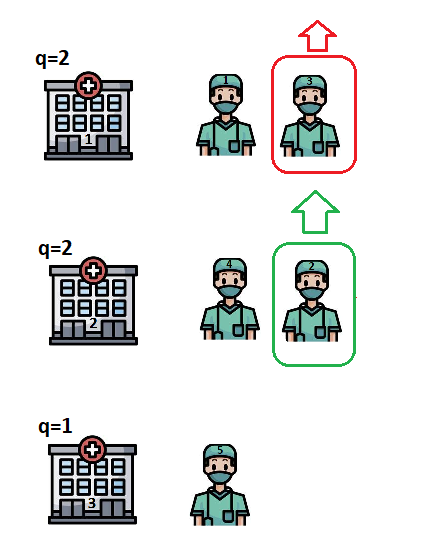
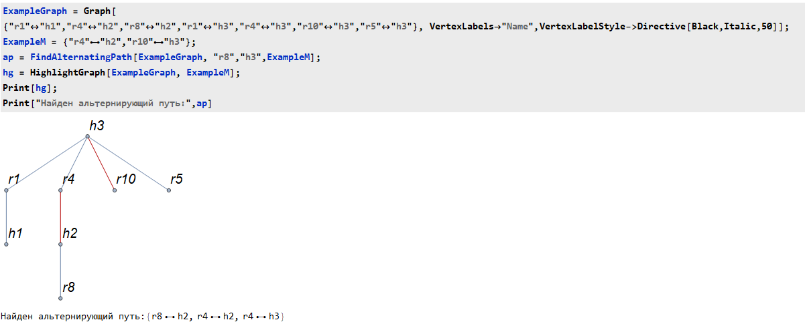
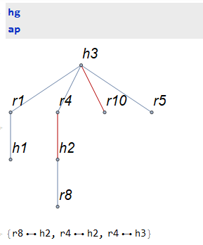
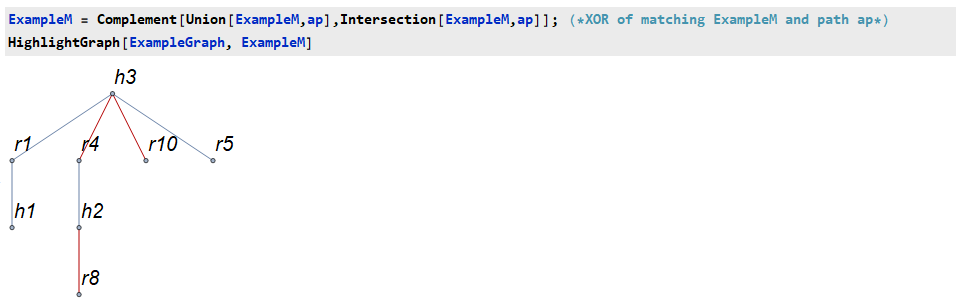
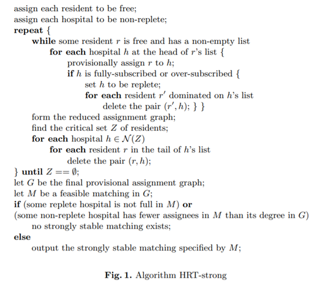
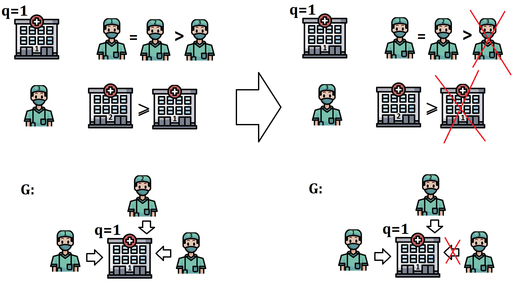
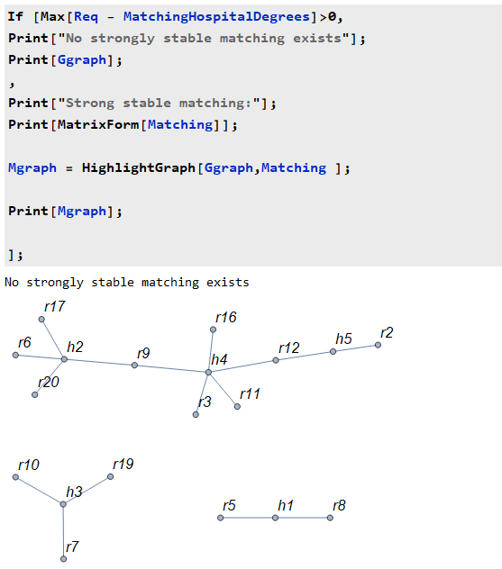
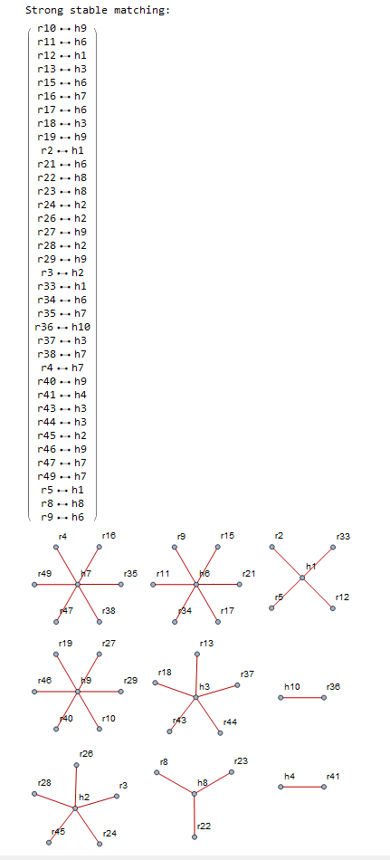

# HRT
Solution of Hospital/Resident Problem with Ties

**Problem instance:**
An instance of the classical Hospitals/Residents problem (HR) with Ties involves two
sets, a set R of residents and a set H of hospitals. Each resident in R seeks to be
assigned to exactly one hospital, and each hospital h ∈ H has a specified number
ph of posts, referred to as its quota. Each resident ranks a subset of H in non-strict (oppositely to classic HR instance)
order of preference, and each hospital ranks, again in non-strict order, those residents
who have ranked it.

Several types of matching's stability appears when extending classic HR to HRT. Strong stable matchings are considered here.

More: https://en.wikipedia.org/wiki/National_Resident_Matching_Program#Matching_algorithm

This repository implements the algorithm from the following article:
Irving, Robert & Manlove, David & Scott, Sandy. (2003). Strong Stability in the Hospitals/Residents Problem. 10.1007/3-540-36494-3_39. 

# Detailed description   

*Slides in russian - Slides.nb*

## Classical Hospitals/Residents Problem

**Hospitals/Residents Problem (HR)** is one of the extensions of the standard mariage problem (SM).
The problem statement includes two sets: a set of **R** residents and a set of **H** hospitals.
Each resident r ϵ R must be assigned to only one hospital, and each hospital h ϵ H has its quota q.

Each hospital ranks some residents in the strict order of its preference:

Each resident ranks some hospitals in the strict order of their preference:

The consistency of the preference lists is that a resident is
present in the list of preferences of a hospital if and only if
the hospital itself is present in the list of preferences of this resident. It is implied everywhere below

## Matching

**Matching** -- a set of pairs of hospitals and residents, in which each resident must be assigned to no more than one hospital, and each hospital has received a number of residents that does not exceed its quota q.

A matching is considered **stable** if there is no such pair (r,h) that are not assigned to each other in the distribution, but it is advantageous for the resident to change the hospital, and for the hospital to replace one of the current residents with this one (or simply get, if the quota has not been exceeded).

Such a pair is called **"blocking pair"**. For example, below such a pair are resident 2 and hospital 1.
The latter does not mind taking resident 2 instead of the third, and for resident 2, in turn, hospital 1 is more preferable than hospital 2, to which he is currently assigned:

**The task of HR is to find a stable distribution!**
The solution of this problem is known and is carried out by modifying the Gale/Shapley algorithm

## Hospitals/Residents with Ties

Hospitals/Residents Problem with Ties (HR) is one of the extensions of HR.

Now the order in the preference lists can be non-strict (everywhere below the >= sign implies that equality is achieved in terms of preferences):

## Stabilities definitions

In connection with the modified formulation of the problem, several types of stability arise!
A blocking pair is a pair (r,h) that are not assigned to each other, where:

1) Weak stability (weak stable)

It is **strictly** advantageous for a resident r - to change the hospital to h
It is **strictly** advantageous for the h - hospital to replace one of the current residents with r

2) Strong stability (strong stable)

It is advantageous for a resident r - **not strictly** to change the hospital to h
It is **strictly** advantageous for hospital h - to replace one of the current residents with r
OR
It is **strictly** advantageous for a resident of r - to change the hospital to h
It is advantageous for hospital h - **non-strictly**  to replace one of the current residents with r

3)Super stable

It is advantageous for a resident r - **not strictly** to change the hospital to h
It is advantageous for hospital h - **not strictly**  to replace one of the current residents with r

The authors of the article consider the *most reasonable requirement* for the distribution of strong stability.
The time complexity of the algorithm implemented below from the article is **O(a^2)**, where **a** is the number of preferences

## Generating random data

The code implements the generation of random data for setting the problem

Ties are implemented by grouping by sublists - all residents/hospitals from the same sublist are considered equal in this list of preferences

## Function Find Alternating Path

Альтернирующий путь относительно подмножества ребёр M (alternating path) - такой путь в графе, рёбра которого поочерёдно то не принадлежат, то принадлежат M

Пример работы функции:

## Function Find Maximum Matching

Using Find Alternating Path, it implements an iterative algorithm for finding a distribution M with the maximum number of edges in a graph with quotas.

Idea:
1. Start with M={}
2. Look for alternative ways from free residents to currently unfilled hospitals
3. If there is such an alternating path p, then M⊕p increases the size of M by 1 while maintaining all constraints
4. The final set M is given as the result of the function:

In addition, the function finds the critical set Z (see below)

Let's find the distribution in the graph:

Example of an iterative step:

r8 did not get into any hospital. However, if there are still places in h3, then r8 can agree with r4 that he will go not to h2, but to h3, thereby freeing up r8's place in h2.

Mathematically, such a transformation is obtained through the XOR of the current set M with the found alternating path: M⊕p

## Algorithm

**Irving, Robert & Manlove, David & Scott, Sandy. (2003). Strong Stability in the Hospitals/Residents Problem. 10.1007/3-540-36494-3_39.**

## Provisional assignment graph:

The main cycle of the algorithm begins with the preliminary assignment of residents to the head of their list of preferences - i.e. the first sublist of hospitals where they want to go. This information is stored in the provisional assignment graph G, for convenience, it has the form of a table:

## Removing dominated residents:

As a result of preliminary appointments, some hospitals may be full or overcrowded. The pairs of residents that are dominated by it should be removed from such separators

Resident r is dominated in hospital h (is dominated in h) if there are at least ph (quota of this hospital) residents who have
already been previously assigned to the hospital and are strictly better than r.

Deleting a pair (r,h) is removing r and h from each other's preference lists (HPrefs and Rprefs) and canceling the negative assignment in G, if there was one.

## Removing dominated residents:
After removing the dominated residents, the pre-appointment process from the slide above resumes as long as there are free residents with a non-empty list of preferences

## Reduced assignment graph

As soon as all residents are assigned (or their list has become empty as a result of deletion and they no longer claim anything), the process of finding the reduced provisional assignment graph GR is started

It is formed from G as follows:

1. We are looking for bound residents in each hospital
A resident is considered tied to hospital h if either the hospital is not full, or the resident is not in the tail - the last sublist of the list of preferences of this hospital.
2. We remove the rib of the resident bound to the hospital, as well as all other ribs originating from the resident.
3. We reduce the hospital quota by 1 after removing the rib. The resulting values are revised quotas
4. If the revised quota of a hospital has decreased to 0, then we remove the hospital from the graph.

# Critical set

A **critical** set Z (critical set) is the set of residents in GR with the maximum shortage of places in hospitals where they are previously assigned.

According to Lemma 6 of the article, Z = U + U', where
U are unassigned residents (unassigned in accordance with M)
U' are residents reachable from the residents of U via an alternating path.

Find Maximum Matching function simultaneously with the iterative finding of the maximum match M considers the critical set Z.

**Neighborhood N (Z)** - a set of hospitals where residents of the critical set are previously assigned.

According to the pack, the pairs from the tail N (Z) should be removed.

After that, the main loop of the program is started again, and so on until one of the iterations produces an empty critical set

# Final answer 

We find a possible distribution in the final graph of preliminary assignments:

There are certain conditions under which the found possible distribution will actually satisfy the conditions of strong stability.
Namely, the number of residents in M:
1) for unfilled hospitals-there must be at least the number of pre-appointed residents in G
2) for filled and overfilled - there must be at least a quota

We calculate the Req-the required number of residents in the distribution for any hospital. Now it is enough to check whether the matching found satisfies the requirement.
If the answer is positive, it will be the desired highly stable distribution
In the case of a negative answer, according to the lemma, neither the found one nor any other one will fit, and the result will be displayed on the screen that a strongly stable distribution does not exist

Example of success of the algorithm:

